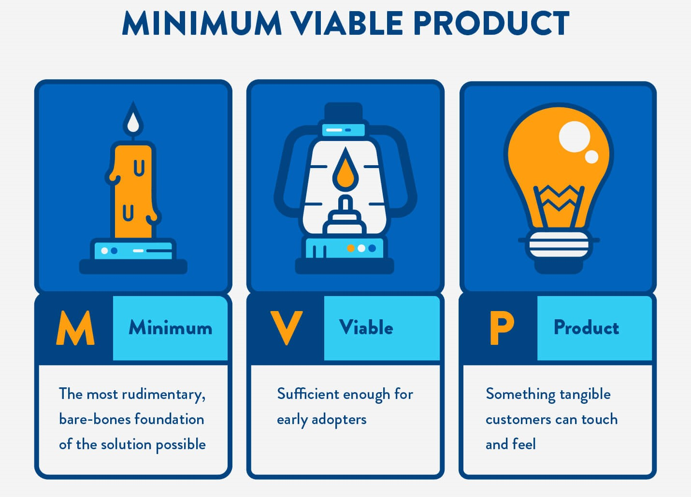

# Minimum Viable Product

## Introduction

- Definition of Minimum Viable Product (MVP)
- Purpose of MVP
- [Minimum Viable Product (MVP)](https://medium.com/@ubf16371/the-importance-of-minimum-viable-product-mvp-in-product-development-49447e2b1c93)

## Description

- Core features of MVP
- Target customers for MVP
- Lean Startup methodology and MVP
- Contrasting MVP with traditional product development methods
- Importance of MVP in validating business ideas and reducing costs

## Example of MVP

- Rippa robot from the University of Sydney

## Purposes of MVP

- Testing a product hypothesis with minimal resources
- Accelerating learning
- Reducing wasted engineering hours
- Getting the product to early customers as soon as possible
- Finding a base for other products
- Establishing a builder's abilities in crafting the required product
- Building a brand very quickly

## Testing

- Importance of testing in MVP
- Benefits of testing
- Methods of testing the financial viability of an idea
- Evaluation of the MVP test results

## Conclusion

- Recap of MVP and its purposes
- Importance of MVP in product development
- Future directions for MVP in product development.