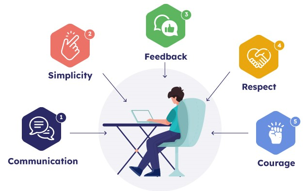

# Discover the Agile Power of Extreme Programming(XP) Framework - The Ultimate Guide:notebook_with_decorative_cover:

Extreme Programming (XP) is an [agile](https://github.com/UsmanUet276/DevOps/blob/main/Week1/Agile%20vs%20Waterfall.md) software development framework that emphasizes on providing software solutions that are of high quality, adaptive to changing requirements, and able to deliver value to the customer frequently.

## XP Principles / Essentials

The XP framework is based on five core principles: 

* Communication
*  Simplicity
* Feedback
* Respect.
* Courage

## History:scroll:

1. XP was developed by Kent Beck in the late 1990s.
2. It was created in response to frustrations with traditional software development methods.
3. Beck outlined the principles and practices of XP in his book "Extreme Programming Explained: Embrace Change" in 1999.
4. XP quickly gained popularity in the Agile software development community.
5. XP has evolved over the years but continues to be an important framework for delivering high-quality software in an Agile way.

## Explanation

### User Stories

 In XP, user stories are used to describe the requirements of the system from the user's perspective. User stories are written by the customer and are used to guide the development process.

### Continuous Integration

XP emphasizes the importance of integrating code frequently. Continuous integration ensures that the code is tested and integrated into the system as soon as possible. This helps in detecting and fixing issues early.

### Test-Driven Development

In XP, developers write tests before writing code. This helps in ensuring that the code meets the requirements and is of high quality.

### Pair Programming

XP encourages pair programming, where two developers work on the same code simultaneously. This helps in improving the quality of the code and sharing knowledge among team members.

### Collective Ownership

In XP, the entire team takes ownership of the codebase. This means that any team member can work on any part of the codebase.

### Planning Game

XP uses the Planning Game to plan the development process. The Planning Game involves the customer and the development team working together to prioritize the user stories and estimate the effort required to complete them.

### On-site Customer

In XP, the customer is present on-site and works closely with the development team. This helps in ensuring that the development process is aligned with the customer's needs.

### Sustainable Pace

XP emphasizes the importance of maintaining a sustainable pace of development. This helps in avoiding burnout and ensuring that the team is productive in the long run.

### Continuous Improvement 

XP encourages continuous improvement. The team regularly reflects on their development process and identifies areas for improvement.

## Conclusion:memo:

XP is an agile software development paradigm that places a strong emphasis on offering software solutions that are of the highest quality, flexible to shifting needs, and capable of regularly delivering value to the client. The framework is built on values like open communication, candor, courage, and respect, and it employs techniques like user stories, test-driven development, pair programming, collective ownership, planning games, on-site customers, sustainable pace, and continuous improvement.

